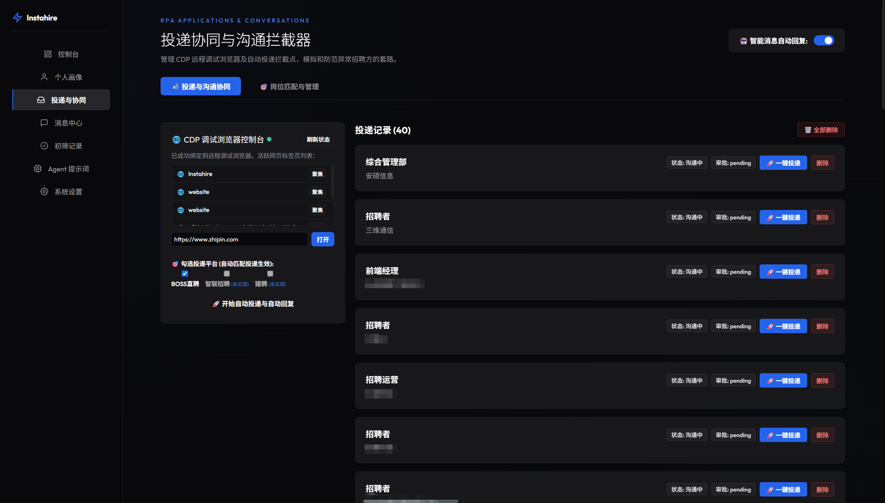
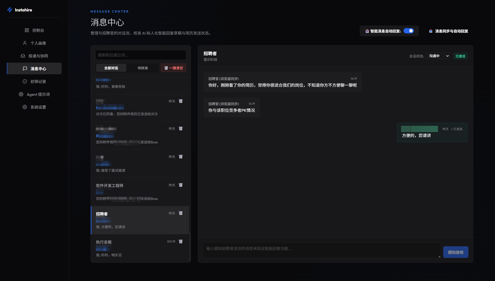
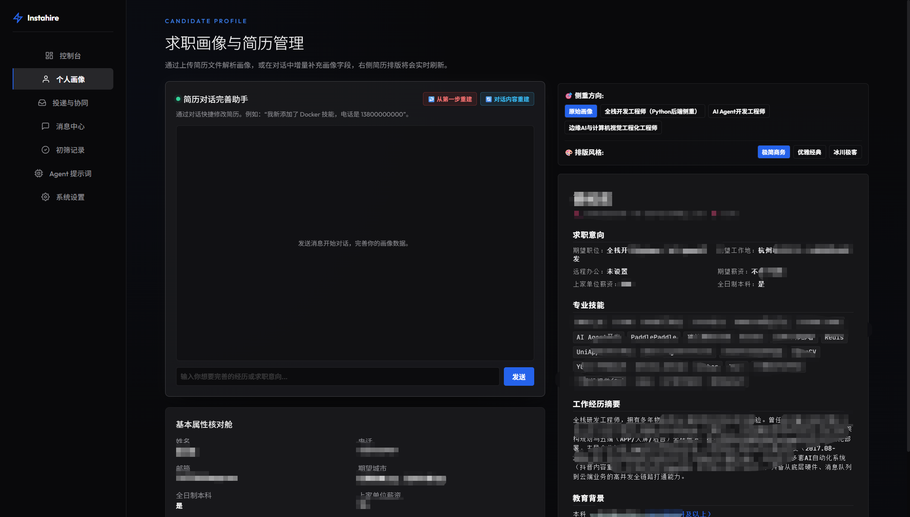

# Instahire (自动化助手)

Instahire is a Windows-first desktop job-search assistant that provides a local job-search cockpit: candidate profile management, manual/automatic job import, LangChain/LangGraph-based job extraction/ranking, resume optimization suggestions, application drafts, and approval-gated browser automation.

---

## 🖥️ Preview Screenshots (界面预览)

| 自动匹配与投递 | 高情商自动回复 | 求职画像与多简历管理 |
| :---: | :---: | :---: |
|  |  |  |

---

## 🏗️ System Architecture (系统架构)

```mermaid
graph TD
    React[React Frontend (Port 8000/dist)] -->|HTTP API / JSON| FastAPI[FastAPI Backend (Uvicorn)]
    FastAPI -->|Services & Workflows| CoreServices[Core Services]
    FastAPI -->|Check License / HWID| Security[Licensing & HWID]
    CoreServices -->|LangChain / LangGraph| AIAgent[AI Resume & Apply Agent]
    CoreServices -->|CDP Commands / WS| ChromeCDP[Chrome Browser via CDP Debugging]
    CoreServices -->|SQLAlchemy| SQLite[(Local SQLite DB)]
    ChromeCDP -.->|Read/Analyze| Qwen[Qwen Chat UI]
```

---

## 📁 Project Structure (项目目录结构)

```text
Instahire/
├── src/instahire/            # 后端核心源码 (Python)
│   ├── api/                  # FastAPI 接口定义，包含各种路由模块
│   │   ├── routers/          # 业务接口路由 (health, activation, profiles, jobs, applications, etc.)
│   │   └── app.py            # FastAPI 应用初始化与中间件配置
│   ├── agents/               # 基于 LangGraph/LangChain 的智能体工作流 (简历优化、匹配评估)
│   ├── automation/           # 自动排期与自动投递机制
│   ├── config.py             # 配置管理类 (Pydantic Settings)
│   ├── core/                 # 核心数据模型与抽象基类
│   ├── llm/                  # LLM 支持包 (包含 MiniMax, Qwen, DeepSeek 等，以及千问 CDP 自动唤醒机制)
│   ├── persistence/          # 数据库持久层 (SQLite / SQLAlchemy)
│   ├── security/             # 安全控制与软件授权校验 (HWID 生成与 Base64 证书验证)
│   ├── services/             # 业务服务层 (简历解析、职位导入、状态管理)
│   ├── sources/              # 职位抓取源与合规适配器 (Scraping Adapters)
│   ├── ui/                   # 历史桌面版 PySide6 界面组件
│   └── utils/                # 通用工具包 (CDP 调试浏览器拉起、PDF/Docx解析器等)
│
├── web/                      # 前端项目 (Vite + React + TypeScript)
│   ├── src/
│   │   ├── api/              # API 请求封装客户端 (client.ts)
│   │   ├── pages/            # 前端页面组件 (仪表盘, 简历管理, 职位列表, 激活页面等)
│   │   └── main.tsx          # 前端入口
│   ├── index.html
│   └── vite.config.ts
│
├── website/                  # 官网宣传网页 (静态 HTML + JS + CSS)
│
├── build_exe.bat             # 一键自动打包构建脚本 (Windows 批处理)
├── package_entrypoint.py     # PyInstaller 打包单文件运行的后台程序入口
├── Instahire.spec            # PyInstaller 编译配置文件
├── pyproject.toml            # Python 依赖与包管理器元配置 (PEP 621)
└── README.md                 # 说明文档
```

---

## 🛠️ Developer Guide (开发与运行指南)

### 1. 环境变量配置
在项目根目录复制一份环境变量模板：
```bash
copy .env.example .env
```
根据需要配置 `.env` 文件中的大模型凭据和调试选项。

### 2. 运行本地开发服务

#### 运行后端 API：
```powershell
# 1. 创建并激活虚拟环境
python -m venv .venv
.\.venv\Scripts\activate

# 2. 安装项目及开发依赖
pip install -e ".[dev]"

# 3. 启动 FastAPI 守护服务 (支持热重载)
uvicorn instahire.api.app:app --reload --port 8000
```

#### 运行前端 Web 开发服务器：
```powershell
cd web
npm install
npm run dev
```
前端默认运行在 `http://127.0.0.1:5173`。

---

## 📦 Production Packaging (生成单文件 EXE 打包)

项目提供了一键编译打包脚本，可产出体积超轻量（仅约 `66 MB`）的免安装单文件绿色程序：

1. 双击运行 **`build_exe.bat`** 即可。
2. 该脚本会自动：
   - 检查或创建独立的虚拟环境 `.venv`；
   - 自动编译 React 前端静态资源 (`web/dist`)；
   - 利用 `pyinstaller` 自动追溯、剪枝并将所有后端和前端静态资源，统一打包进一个 `dist\Instahire.exe`。
3. 编译好的程序会生成在：📁 **`dist\Instahire.exe`**。

---

## 🔑 Licensing & HWID System (授权激活机制)

本系统采用“一机一码”硬件绑定授权激活机制：
* **HWID 生成**：通过获取主板 UUID、CPU ID、硬盘序列号进行 SHA256 加密生成机器唯一指纹。当遇到系统禁用 `wmic` 时，会自动无缝降级为网卡 MAC 地址。
* **验证机制**：后端利用 HMAC-SHA256 算法对 `指纹 + 有效期` 进行签发与比对，保证授权无法在多台机器间非法共享。

### ⚠️ 常见运行与激活故障 (Troubleshooting)

**问题：运行激活时，页面报错提示 `Failed to fetch`**
1. **代理软件拦截**：如果您开启了 **Clash, v2rayN** 等代理工具且未设置本地回退，`fetch` 本地地址的请求会被强行代理转发导致失效。请**临时关闭代理软件**或将 `127.0.0.1` 设为绕过。
2. **杀毒软件静默挂载/拦截**：由于未签名，360 安全卫士、火绒、Windows Defender 等安全防御软件可能会静默杀掉 `Instahire.exe` 的网络监听或 CDP 子进程，导致通信中断。请将软件加入杀毒信任区。
3. **端口冲突**：确保本地机器 `8000` 端口未被其他服务占用。
